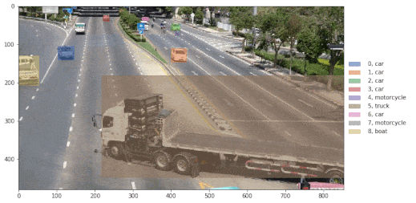

### Purpose

Baseline methods for object tracking simply compute [IoU](https://en.wikipedia.org/wiki/Jaccard_index) over consecutive frames to track objects detected by bounding boxes.  
Here I tried to use the feature map associated with each bounding boxes instead, as a proof of concept. I took the time to document each parts of the code, which coupled with the simplicity of the task might make it a good introductory example to deep learning.


_Result example from a random youtube video_

### Setup
This will download ~200Mb of example data, ~100Mb of example results and a bit of code.
You could run the script in a bare ubuntu docker image, or in your virtual environment of choice.
```sh
./setup.sh
```

### Usage
Open the jupyter notebook ([how to install jupyter](https://jupyter.org/install)) [Tracking_using_feature_maps.ipynb](Tracking_using_feature_maps.ipynb) for details about the method.

### TODO
- [ ] Dockerize
- [ ] Add one command script to track objects
